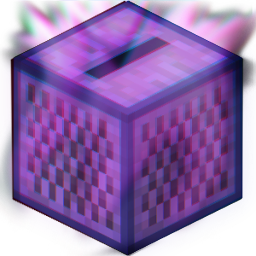

# Music Disk DJ

---
This mod allows you to seamlessly search music from YouTube and Soundcloud within the game and provides the functionality to replace vanilla music discs with your favorite songs. Also share your playlists with other players via books (beta 0.8.0, YT only for now). The mod is designed to be fully client-side.

## Download

---
You can find a ready-made build of this mod on the [releases page](https://github.com/Plugway/MusicDiskDj/releases).

## Dev Section

---
TODO:  
- [x] add soundcloud support 
	- [x] sc/yt link label
	- [ ] parse sc links
	- [ ] import/export through books
	- [x] add reconnect button and connection info (Search results from: YT, SC    🔄)
- [ ] remove garbage code  
- [ ] System.out.println -> logger
- [ ] directional sound option (low priority)
- [ ] dynamic results count (low priority)
- [ ] Resource pack is not enabling when created for the first time (low priority)
- [x] handle all ignored exceptions
	- [x] Fix freezing when trying to download when yt-dlp is not allowed to access the Internet (try again after a while)
- [x] Cache tracks with info for faster minor changes in playlist
- [x] add missing cutStringTo();
- [x] Fix special characters in names when exporting
- [x] Fix names issue
- [x] add import/export through books
- [x] Disable interactions with results before update completes(fixed with different approach)
- [x] Highlight discs with tracks
- [x] Reset mod state when exiting to the main menu
- [x] Disc names do not change after applying changes
- [x] read current downloaded songs from resource pack after minecraft reloading(from local config file? to share through books) 
- [x] Fix regex for yt links
- [x] remove lag when open gui
- [x] fix previews(how?)  
	- [x] Remove generatePreviews thread call when gui opened first time
- [x] add 1.20 disk
- [x] disable search button when searching
- [x] translate titles
- [x] rework results block gui
- [x] change pack format to 15 (1.20)
- [x] add statusbar  
- [x] add progressbar 
- [x] split progress to sections somehow, switch sections in progress, each section from 0% to 100%
- [x] add name in main gui  (blink Music Disk DJ in search suggestion hint field)
- [x] maybe add direct link paste
